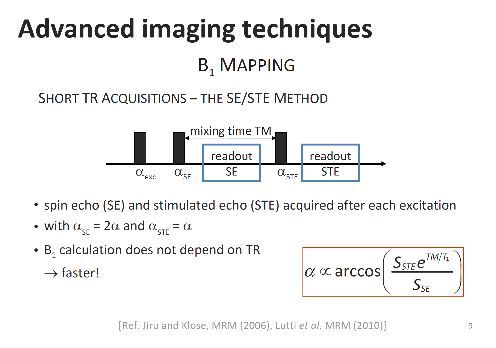

# MPM sequence 

## Specific  acquisition parameters

This list the parameters as being used by the [hMRI toolbox]([http://hmri.info](http://www.hmri.info/)), as of November 2019-- .

---

| Fieldnames queried by the hMRI toolbox |Fieldnames for BIDS | In BIDS or description/comments |
| ---- | ---- | ---- |
| **MACHINE NAMING** | | |
| `Manufacturer` | `Manufacturer` | YES |
| `ManufacturerModelName` | `ManufacturersModelName` | YES |
| `DeviceSerialNumber` | `DeviceSerialNumber` | YES |
| `StationName` | `StationName` | YES |
| `MagneticFieldStrength` | `MagneticFieldStrength` | YES |
| | | |
| **SEQUENCE NAMING** | | |
| `ScanningSequence` | `ScanningSequence` | YES |
| `SequenceName` | `SequenceName` | YES |
| `ProtocolName` | `PulseSequenceDetails` |  YES, assuming it fits |
| | | |
| **Main acquisition parameters** | | |
| `RepetitionTime` | `RepetitionTimeExcitation`	| YES |
| `EchoTime` | `EchoTime` | YES |
| `FlipAngle` | `FlipAngle` | YES |
| `MT` | `MTState` | YES |
| | | |
| **IN-PLANE ENCODING** | ||
| `NumberOfMeasurements` | `NumberShots` | YES, assuming it fits |
| `epiReadoutDuration` | `TotalReadoutTime` | YES, assuming it fits |
| `PhaseEncodingDirectionSign` | `PhaseEncodingDirectionSign` | NO, it should be `SliceEncodingDirection` but here only the sign is known. |
| | | |
| **RF CORRECTION**  in al_B1mapping and mtflash3d sequences | |  |
| `RFSpoilingPhaseIncrement` | `SpoilingRFPhaseIncrement` | YES |
| `spoilingGradientMoment` | `SpoilingGradientMoment` | YES |
| `spoilingGradientDuration` | `SpoilingGradientDuration` | YES |
| | | |
| **3D_EPI FOR B1 MAPPING** | | |
| `B1mapNominalFAValues` | `NominalFAValues` | NO |
| `B1mapMixingTime` | `MixingTime` | NO |

### Comments:

Most metadata already exist in BIDS-BEP001. 

A few things are assumed to match and others should/could be added:

- `ProtocolName` sounds like `PulseSequenceDetails`, at least they can store a sequence identification code

- `NumberOfMeasurements`,  used to get the `B1mapNominalFAValues`, could be the same as `NumberShots`, defined as
  
> The number of RF excitations need to reconstruct a slice or volume. Please mind that this is not the same as Echo Train Length which denotes the number of lines of k-space collected after an excitation. 

To be checked.

- `epiReadoutDuration` sounds quite like `TotalReadoutTime`, defined as
  > This is actually the "effective" total readout time , defined as the readout duration, specified in seconds, that would have generated data with the given level of distortion. It is NOT the actual, physical duration of the readout train.

	What about the potential acceleration factors? 

- `PhaseEncodingDirectionSign` is only about the sign of the phase encoding direction but NOT the direction itself. Or should direction and sign be extracted ? Both direction and sign are coded by `SliceEncodingDirection` with values  `i`, `j`, `k`, `i-`, `j-`, `k-`.
  To be further investigated to to reliably extract this from the DICOM header.

- B1 mapping (B1+) parameters are not (yet) part of BEP001 and would have to be added. 
  What is missing is a clear definition of each of these parameters...

### B1+ parameters

Some information from Evelyne Balteau and a figure.

- `MixingTime` is something typical for a stimulated echo sequence  (pulse 1 - dephasing - pulse 2 - mixing time: magnetisation is stored  along longitudinal axis, no further dephasing - pulse 3 - rephasing and  recording of stimulated echo aka STE). This type of sequence is mainly  used in MR spectroscopy... So it is "just" a matter of adding a standard  parameter, when applicable, called "MixingTime"... Here we also acquire  a standard spin-echo (aka SE) image during the mixing time (because not  all the spins are following the STE pathway determined with a purely  90-90-90 pulse sequence). 

- `FlipAngle` and `NominalFAValues`. The standard FA here is the alpha_exc (it is likely to be  90°), while the "B1 map nominal FA values" are the series of values used  for alpha. E.g. in our B1 mapping case, we have 11 pairs of SE/STE  volumes.  

Illustration of the B1+ mapping sequence: 
